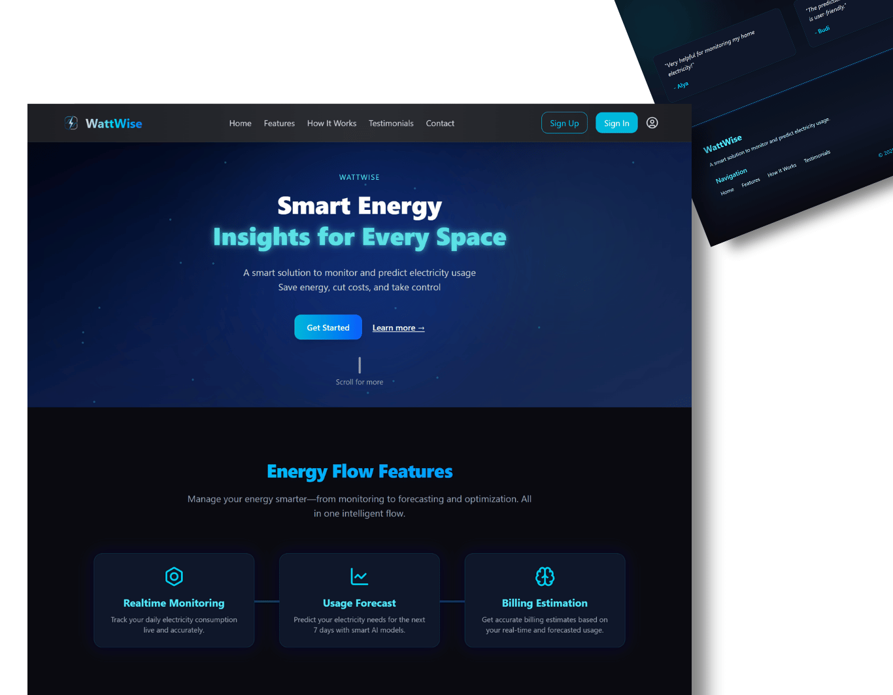
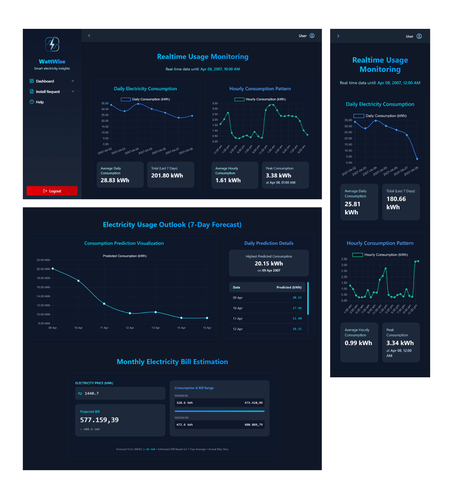
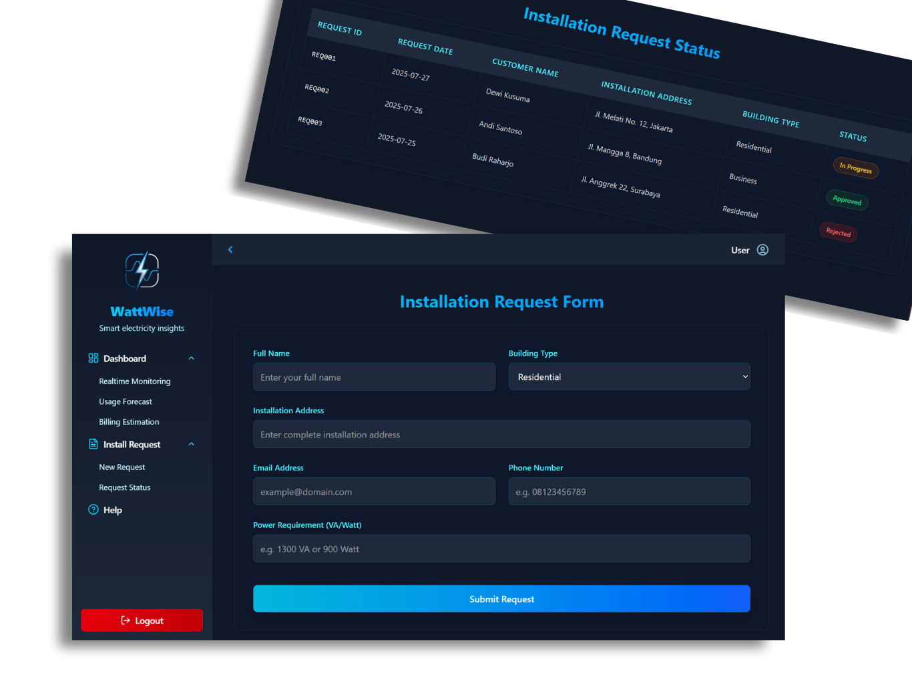

# ⚡ WattWise Energy Tracker

WattWise is an intelligent web app that helps users monitor and forecast electricity usage in real time — built with a glowing neon aesthetic to power up your smart energy journey.

---

## 🚀 Why This Project Stands Out
- Futuristic dark-blue + cyan glow interface for a modern electric vibe  
- Real-time usage monitoring with live graph updates  
- 7-day electricity consumption forecast using LSTM, BiLSTM, and CNN  
- Smart billing estimation based on predicted usage  
- Built with React frontend, FastAPI backend, and TensorFlow AI models  

---

## 📸 Preview  
Here’s a glimpse of WattWise:

### Landing Page

### Dashboard Page

### Install & Status Page

---

## 💡 Features
- **Landing page** with interactive animation
- **Realtime Monitoring** – Daily & hourly usage tracking  
- **AI Forecast** – 7-day electricity prediction using deep learning  
- **Bill Estimator** – Accurate billing based on consumption models  
- **Install Request System** – Easy onboarding for new users   

---

## 🛠 Built With
- **Frontend**: React + Tailwind CSS + Framer Motion + Chart.js
- **Backend**: FastAPI (Python)
- **AI**: TensorFlow (LSTM, BiLSTM, CNN models)  
- **Deployment**: Vercel (frontend) 

---

## 🌐 Live Demo  
🔗 [Try the Live Demo Here](https://webai-wattwise-energytracker.vercel.app/)

> ⚠️ Backend is **not yet deployed**, so features like real-time monitoring, AI forecast, and billing estimation **are currently non-functional**.  

> **Demo Login** – Try it with:  
Email: `us@example.com`  
Password: `pass123` 

---

## Created by [@kinannwidya](https://github.com/kinannwidya)
